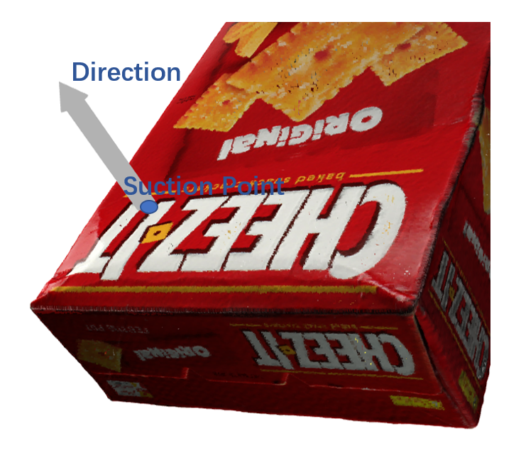

# API for SuctionNet-1Billion

API for SuctionNet-1Billion dataset of RA-L paper "SuctionNet-1Billion:  A  Large-Scale  Benchmark  for  Suction  Grasping" 

## Dataset

## Suction Definition

## Installation

`pip install .`

## Evaluation Prerequisite

To evaluate predictions, please make sure you have dense point clouds generated from mesh models by poisson dist sampling. To generate dense point clouds from mesh models, one should first install the [Point Cloud Utils](https://github.com/fwilliams/point-cloud-utils) library and run:

`python create_dense_pcd.py --model_root /path/to/graspnet/models --save_root /path/to/save/dense/point/clouds`

## Examples

## Citation

